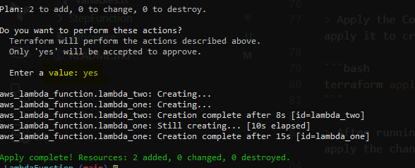
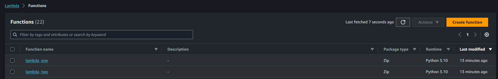

# Lambda Function

[AWS Lambda](https://docs.aws.amazon.com/lambda/latest/dg/welcome.html) is a computing service that lets you run code without provisioning or managing servers.

In this code, we have two lambdas:

1. [Lambda_one](./Lambda_one/): AWS Lambda function to validate a 'client_name' and return a modified value if valid.

    Returns:

```JSON
{"client_name": "nike"}
```

---

2. [Lambda_two](./Lambda_two/): Lambda function to check if the provided 'client_name' is in a list of valid clients. If the 'client_name' is in the list of valid clients, a success message is returned; otherwise, None is returned.

    Returns:

```JSON
{"message": "[SUCCESS] Database -> |nike| created for client : nike."}
```

## Terraform execution

<details>
<summary>terraform init</summary>

> Initialize Your Terraform Configuration: **terraform init** is used to initialize a working directory containing Terraform configuration files. It downloads and installs the necessary providers, modules, and plugins specified in your configuration.

```terraform
terraform init
```


</details>

<details>
<summary>terraform plan</summary>

> Generate and Review an Execution Plan: **terraform plan** generates an execution plan, which is a description of what Terraform will do when you apply the configuration. It shows you the changes that Terraform intends to make to your infrastructure without actually making any changes.

```terraform
terraform plan
```


</details>

<details>
<summary>terraform validate</summary>

> Validate Your Configuration: **terraform validate** is used to check your configuration files for syntax errors and other basic errors. It's a quick way to catch issues before you attempt to apply the configuration.

```terraform
terraform validate
```


</details>

<details>
<summary>terraform apply</summary>

> Apply the Configuration (if everything looks good): Once you've successfully initialized, planned, and validated your configuration, you can apply it to create or modify your infrastructure. Be cautious, as this step can make changes to your cloud resources.

```terraform
terraform apply
```

> After running **terraform apply**, you'll be prompted to confirm the changes. Review the execution plan and type 'yes' when prompted to apply the changes.





</details>
