# Step Function

[AWS Step Function](https://docs.aws.amazon.com/step-functions/latest/dg/welcome.html) is a serverless orchestration service that lets you integrate with AWS Lambda functions and other AWS services to build business-critical applications. Through Step Functions' graphical console, you see your application’s workflow as a series of event-driven steps.

In this code, we have step function defined to run two Lambda functions i.e. [Lambda_one](../LambdaFunction/Lambda_one/) and [Lambda__two](../LambdaFunction/Lambda_two/) step by step.

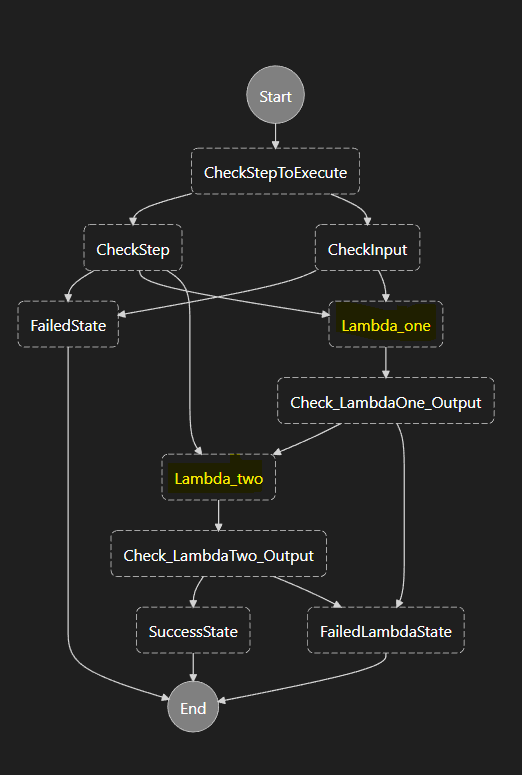

## Terraform execution

<details>
<summary>terraform init</summary>

```terraform
terraform init
```

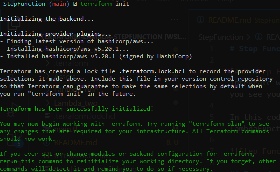
</details>

<details>
<summary>terraform plan</summary>

```terraform
terraform plan
```

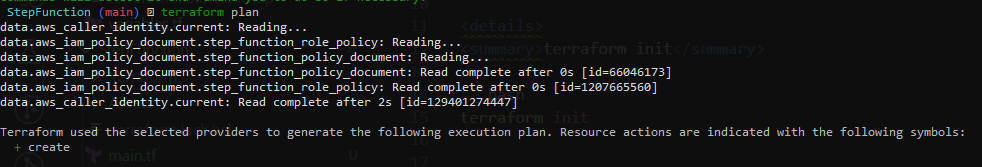
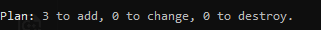
</details>

<details>
<summary>terraform validate</summary>

```terraform
terraform validate
```

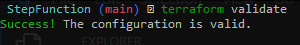
</details>

<details>
<summary>terraform apply</summary>

```terraform
terraform apply
```

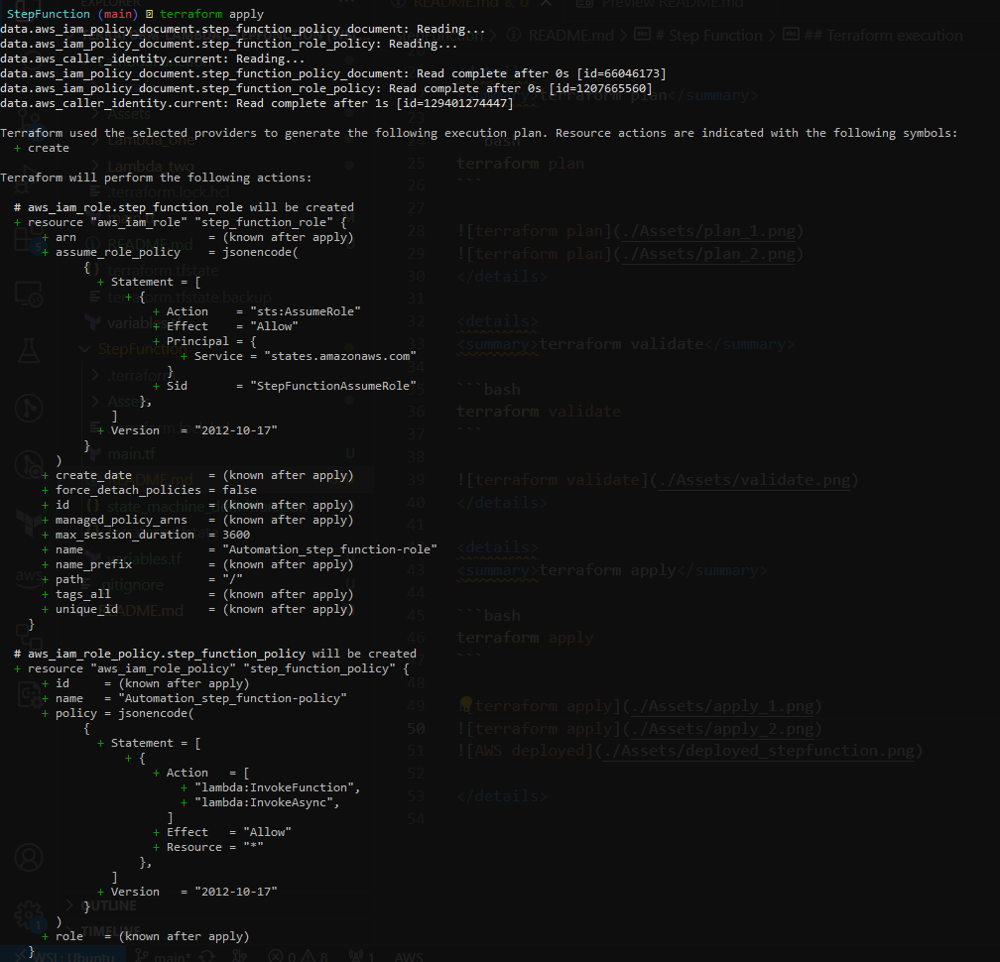
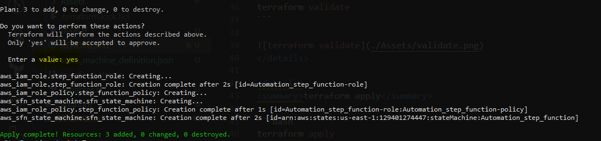
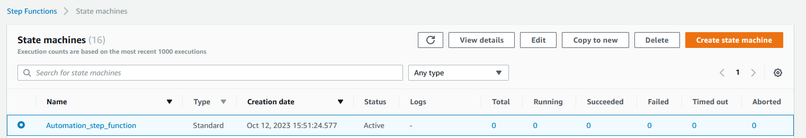
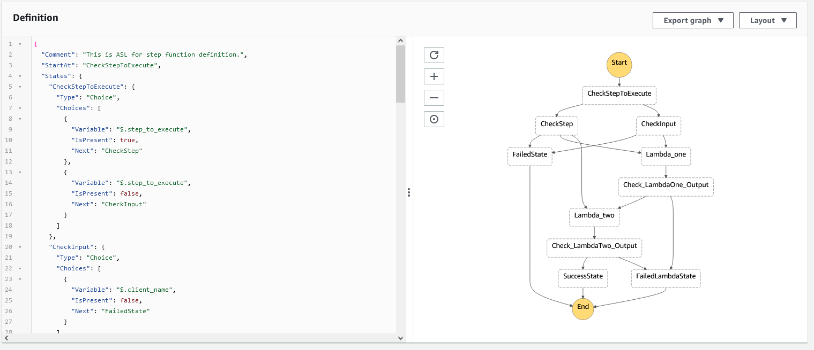
</details>

### Test Execution

Test the execution by providing following input to step function :

```JSON
{
  "client_name": "Adidas"
}
```

The step function executes successfully :
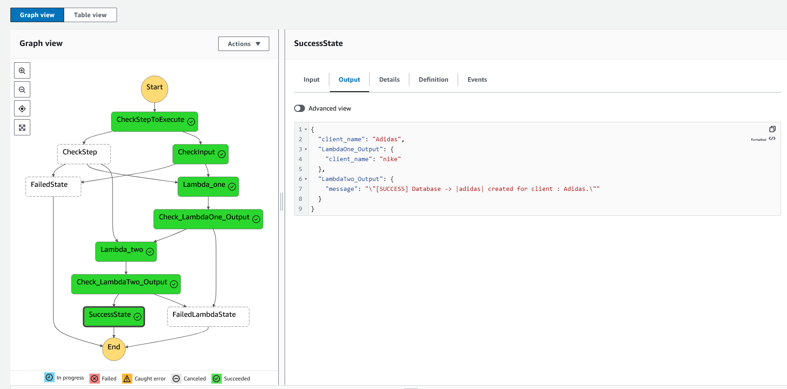
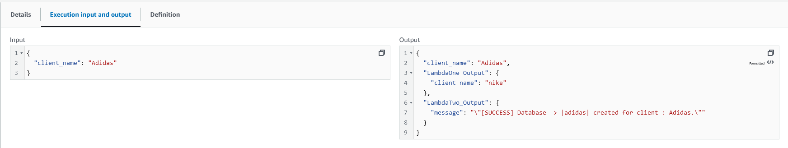
